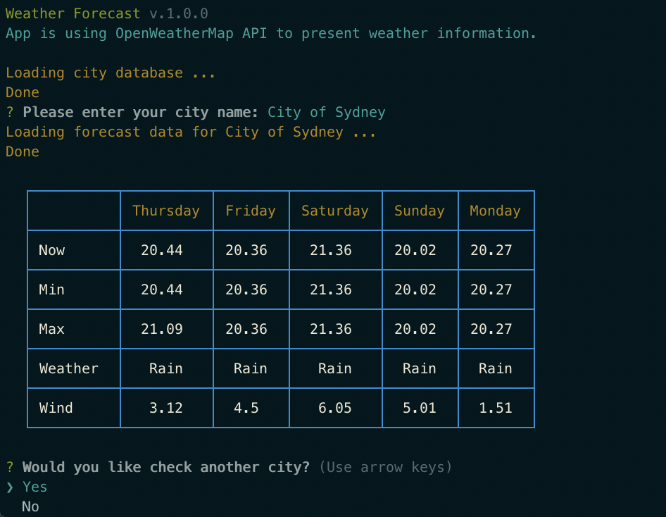

# Weather Forecast

Weather forecast is a Node.js app to display the temperature and weather based on city name.

App is using https://openweathermap.org/ API.

# Install Node.js

Please follow the instructions to install the Node.js framework on your dev machine:

https://nodejs.org/

# Get source code:
git clone https://github.com/mrhadi/weather-forecast.git

# Get dependencies
npm install

# Run project
npm start

